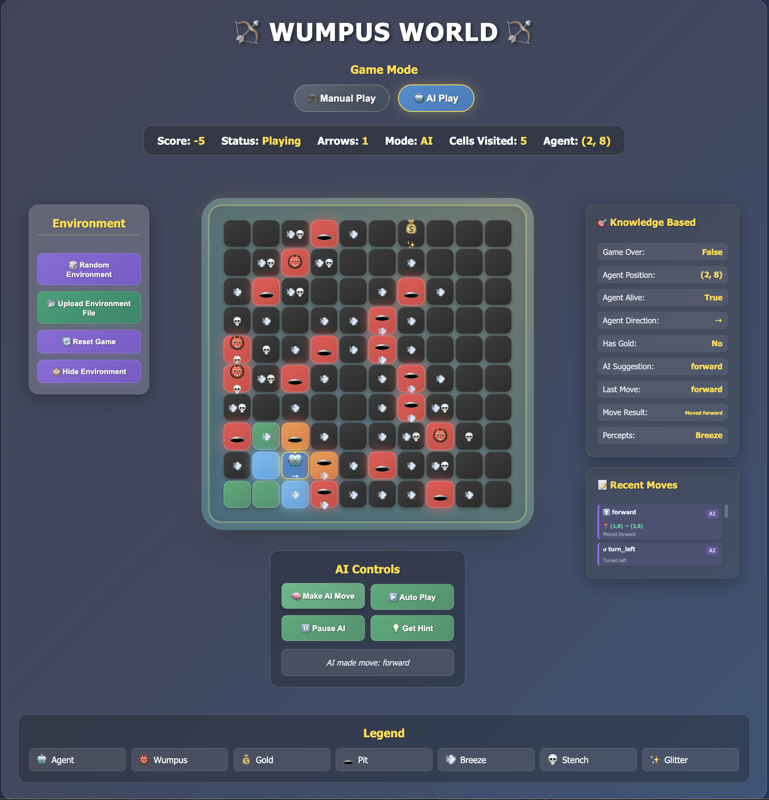

# Wumpus World Game

This project implements the classic Wumpus World game, featuring both manual and AI-driven gameplay.
The game is built using Django and provides a web interface for interaction. The AI agent uses logical inference to navigate the Wumpus World, making decisions based on percepts and a knowledge base.

### Prerequisites

-   Python 3.x
-   Django framework
-   Basic knowledge of Django and Python

## How to Run the Code

To set up and run the Wumpus World game, follow these steps:

### Clone, Setup and Run setps
1.  **Clone the repository:**

    ```bash/zsh
    git clone https://github.com/Hasnain1408/Wumpus_World.git
    ```

2.  **Navigate to your project folder:**

    ```bash/zsh
    cd path/to/WUMPUS_WORLD
    ```

3.  **Create a virtual environment (macOS/Linux):**

    ```bash/zsh
    python3 -m venv venv
    ```

4.  **Activate the environment:**

    ```bash/zsh
    source venv/bin/activate
    ```
5.  **Go to backend folder:**
    ```bash/zsh
    cd backend
    ```    

5.  **Install dependencies:**

    ```bash/zsh
    pip install -r requirements.txt
    ```

6.  **Run the Django development server:**

    ```bash/zsh
    python3 manage.py runserver
    ```

    This will start the web server, and you can access the game in your browser, usually at `http://127.0.0.1:8000/`.

## Features

-   **Manual Play Mode:** Control the agent manually through the web interface.
-   **AI Play Mode:** An intelligent agent navigates the Wumpus World using logical inference.
-   **Dynamic Environment Loading:** Load custom Wumpus World environments from text files.
-   **Random Environment Creating:** User can create random environment
-   **Environment Visibility:** User can see the environment and hide the environment
-   **Visual Representation:** A clear and interactive grid-based display of the Wumpus World.
-   **Game State Tracking:** Displays score, arrows, cells visited, agent position, and game status.
-   **Knowledge-Based System:** The AI agent uses a knowledge base to make informed decisions.

## Game Logic

The Wumpus World game involves an agent navigating a grid to find gold while avoiding pits and the Wumpus. The agent perceives breezes near pits and stenches near the Wumpus. The core logic includes:
-   **Grid Representation:** The game board is represented as a grid where each cell can contain the agent, Wumpus, gold, or pits.
-   **Percepts:** Breeze (from pits), Stench (from Wumpus), Glitter (from gold), Bump (hitting a wall).
-   **Actions:** Move (Up, Down, Left, Right), Grab Gold, Climb Out.
-   **Knowledge Base:** The AI agent builds a knowledge base based on percepts to infer the location of pits and the Wumpus.
-   **Safe Cells:** The AI identifies safe cells to move into, minimizing risk.
-   **Pathfinding:** The AI uses a pathfinding algorithm to navigate to target cells (e.g., gold, exit).

## Folder Structure

```
WUMPUS_WORLD/
├── backend/ # Django backend application
│   ├── backend/ # Main Django project settings
│   │   ├── __init__.py
│   │   ├── asgi.py
│   │   ├── settings.py
│   │   └── wsgi.py
│   └── wumpus/ # Wumpus World Django app
│       ├── logic/ # Core game logic and AI modules
│       │   ├── auto_play.py # AI agent's automatic play logic
│       │   ├── board.py # Manages the game board and its state
│       │   ├── game.py # Main game loop and rules
│       │   ├── logical_inference.py # AI's knowledge base and inference engine
│       │   ├── manual_play.py # Handles manual agent controls
│       │   ├── move.py # Defines agent movement and actions
│       │   └── wumpus.txt # Default Wumpus World environment configuration
│       ├── static/ # Static files (CSS, JavaScript)
│       │   ├── script.js # Frontend JavaScript for game interaction
│       │   └── style.css # Frontend CSS for styling
│       ├── templates/ # HTML templates
│       │   └── board.html # Main game interface HTML
│       ├── urls.py # URL routing for the Wumpus app
│       └── views.py # Django views to handle requests and render templates
├── manage.py # Django management utility
├── package-lock.json # Frontend package lock file (if applicable)
├── requirements.txt # Python dependencies
├── project-details/ # Project documentation and details
│   ├── plan-features.txt
│   └── project-run-commands.txt
└── images/ # Contains screenshots and other project-related images
```

## Input File Format (wumpus.txt)

The `****.txt` file defines the layout of the Wumpus World. It's a simple text file where each line represents a row in the grid, and characters represent different elements:
-   `A`: Agent (Starting Position)
-   `W`: Wumpus
-   `G`: Gold
-   `P`: Pit
-   `-`: Empty cell

**Example `wumpus.txt`:**

```
---P--G---
--W-------
-P----P---
-----P----
W--P-P----
W-P---P---
------P---
P-P----W--
---P-P----
A--P---P--
```

This example represents a 10x10 grid with an agent at (0,9), a Wumpus at (7,7), gold at (6,0), and a pit at (3,9).

## Game States

Here are some screenshots illustrating different game states and features:

### Initial Game State (Manual Play)


### AI Play Mode Activated


### Agent Moving and Discovering Percepts



### Show Environment


### Agent Grabbing Gold


### Game Over (Win)


### Game Over (Loss)


### Uploading Custom Environment


### AI Suggestion/Hint


